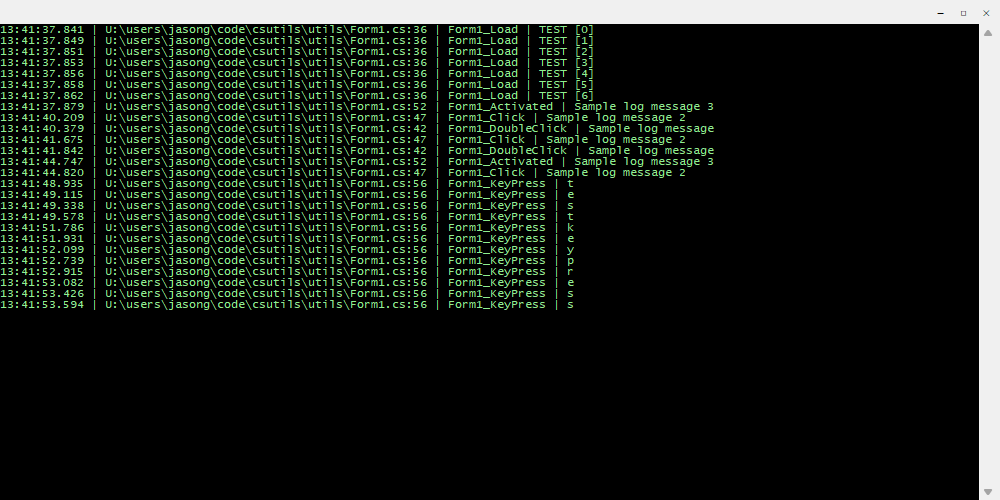

# C# Utils
Set of simply utilities built in C#.
## Class
### Verbose
A class that allows for the logging of text to a sperate WPF form.



Example:

```cs
        private void Form1_Load(object sender, EventArgs e)
        {
            string[] args = Environment.GetCommandLineArgs();
            foreach (string arg in args)
            {
                if (arg == "-v" || arg == "--verbose")
                {
                    debug.CreateForm();
                }
            }

            for (int i = 0; i < 7; i++)
            {
                debug.Append($"TEST [{i}]");
            }
        }
```

#### Methods

##### CreateForm
`public static void CreateForm()`

Creates the form where output will be sent.

##### Write
`public static void Write(string input)`

Will write the `input` string to the form, overwriting previous text.

##### Append
`public static void Apped(string input)`

Will append the `input` string to the form.

##### Clear
`public static void Clear`

Will remove all text from the form.

##### Size
`public static void Size(int width, int height)`

Sets the size of the form.

##### FormFont
`public static void FormFont(Font font)`

Sets the font to be used on the form itself (the form title and the minimize, maximize, and close buttons).

##### Icon
`public static void Icon(MemoryStream iconData)`

Set the icon to be used by the form.

##### Title
`public static void Title(string title)`

Set the title of the form.

##### ShowIcon
`public static void ShowIcon(bool show)`

Sets the ShowIcon property for the form.

##### ShowInTaskbar
`public static void ShowInTaskbar(bool show)`

Sets the ShowInTaskbar property for the form.

##### TextColor
`public static void TextColor(Color foreColor, Color backColor)`

Sets the text color for the textbox of the form.

##### TextFont
`public static void TextFont(Font font)`

Sets the font for the textbox of the form.
